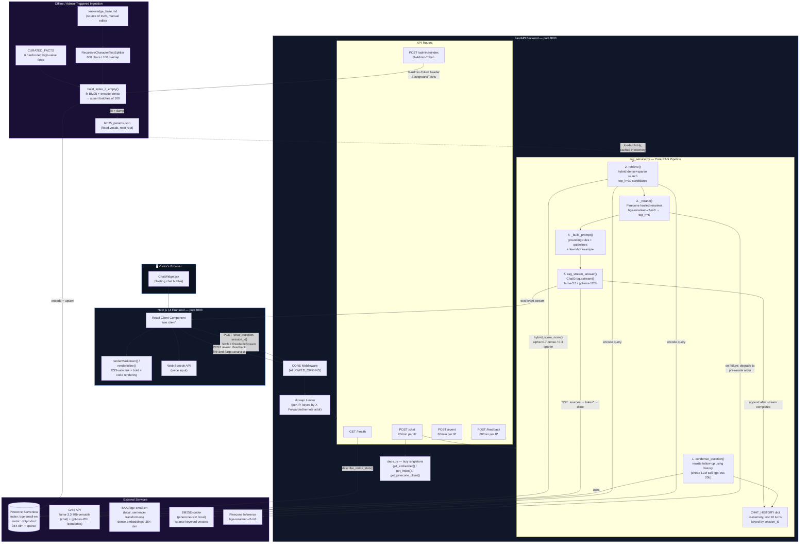

# Stackular Chatbot — System Architecture

Living reference for explaining this project end-to-end: what each piece is, what it talks to, and how data moves through the system. Written against the current state of the `text_rag` branch (verified against source, not just docs).

---

## 1. The One-Sentence Pitch

A **Retrieval-Augmented Generation (RAG) chatbot** embedded on the Stackular marketing site. A visitor asks a question → the backend retrieves the most relevant chunks of company knowledge from a vector database → an LLM writes a grounded answer using only that retrieved context → the answer streams back to the browser token-by-token.

This is the core pattern behind almost every "chat with your docs" product (customer support bots, internal knowledge assistants, etc.), which is exactly why it's a strong interview project — it touches vector search, hybrid retrieval, reranking, prompt engineering, streaming APIs, and rate limiting.

---

## 2. Full System Diagram



> Render this directly in GitHub/GitLab (Mermaid is natively supported) or paste into [mermaid.live](https://mermaid.live) for a walkthrough view.

---

## 3. The Two Data Flows — Explain These Separately

Your friend should present this as **two distinct pipelines**, because that's what interviewers are listening for (most candidates conflate them):

### Flow A — Query-Time (runs on every chat message)

```
Visitor types question
   → POST /chat (session_id + question)
   → rate limiter checks IP (20 req/min)
   → condense_question(): rewrite "tell me more about that" into a standalone
     query using last 5 turns of history (cheap LLM call — prevents pronoun
     ambiguity from breaking retrieval)
   → retrieve(): embed query twice — dense (BGE model) + sparse (BM25) — and
     run ONE hybrid query against Pinecone (top_k=30)
   → _rerank(): send the 30 candidates + query to Pinecone's hosted
     cross-encoder reranker, keep the best 6
   → _build_prompt(): stuff those 6 chunks + history into a strict prompt
     (grounding rules, off-topic handling, few-shot format example)
   → ChatGroq.astream(): tokens stream back over Server-Sent Events
   → frontend appends each token to the last message bubble in real time
```

### Flow B — Ingestion-Time (runs only on `POST /admin/reindex`)

```
Admin edits knowledge_base.md
   → POST /admin/reindex with X-Admin-Token header
   → verified as background task (doesn't block the request)
   → knowledge_base.md is split on markdown headings, chunked (600 chars),
     source URLs attached as metadata
   → CURATED_FACTS (6 hardcoded facts) appended
   → BM25Encoder fit on the full corpus → dumped to bm25_params.json
   → BGE model encodes dense vectors for every chunk
   → vectors (dense + sparse + metadata) upserted to Pinecone in batches of 100
   → in-memory BM25 cache reset so the next query uses fresh vocab
```

**Why this split matters for the interview**: it shows understanding that *retrieval* (search) and *generation* (answering) are separate concerns, and that the index must be rebuilt whenever the underlying knowledge changes — this is the #1 thing RAG beginners get wrong (they think the LLM "knows" the docs; it doesn't, it only sees what retrieval hands it per-request).

---

## 4. Why Hybrid Search (Dense + Sparse)?

This is the single most "senior" detail in the project — worth spending real time on.

| | Dense (BGE embeddings) | Sparse (BM25) |
|---|---|---|
| Good at | Semantic meaning ("cloud modernization" ≈ "moving to AWS") | Exact keyword/acronym matches ("Stackular", "AWS", job titles) |
| Bad at | Rare terms, exact names, acronyms | Paraphrasing, synonyms |
| Vector type | 384-dim dense float array | Sparse indices+values (like a weighted bag-of-words) |

`hybrid_score_norm(dense, sparse, alpha=0.7)` scales dense scores by 0.7 and sparse by 0.3 before Pinecone combines them in one query — this requires the index to use the **`dotproduct`** metric (cosine breaks hybrid scoring, which is a documented gotcha in this repo — see `known-issues.md`).

**Then a second-stage reranker** (`bge-reranker-v2-m3`, hosted by Pinecone) re-scores the top 30 hybrid results with a more expensive cross-encoder model, keeping only the best 6. This two-stage "retrieve broad, then rerank narrow" pattern is standard in production RAG systems — it balances recall (hybrid search casts a wide net) against precision (reranker picks the true best matches) without paying cross-encoder costs on the whole corpus.

---

## 5. Resilience Patterns Worth Highlighting

The code has several deliberate graceful-degradation points — good talking points for "tell me about a time you handled failure":

1. **Hybrid search fails → falls back to dense-only** (`retrieve()`, `rag_service.py:250-257`) — if Pinecone's index isn't `dotproduct` or hybrid query errors, it retries with dense vectors only rather than crashing the chat.
2. **Reranker fails → falls back to pre-rerank order** (`_rerank()`, `rag_service.py:228-230`) — a rerank API outage never breaks the chat; it just serves slightly less-optimal ordering.
3. **Query condensing fails → uses raw question** (`condense_question()`, `rag_service.py:316-318`) — same philosophy, isolate the "nice-to-have" step from the critical path.
4. **LLM stream fails → SSE `error` event, not a hung connection** (`rag_stream_answer()`, `rag_service.py:445-451`) — the frontend gets a clean error message instead of a stuck spinner.

Every external call in this pipeline (Pinecone hybrid query, reranker, condense LLM) is wrapped so a single provider hiccup degrades quality, not availability.

---

## 6. Prompt Engineering Details

`_build_prompt()` is not a naive "answer this" template. It layers:

- **Persona** — speak as "we/our", never "I".
- **Grounding rules** — answer *only* from retrieved context; explicit instruction to treat context and the user's question as *data, not instructions* (a prompt-injection defense — if a visitor tries "ignore previous instructions", the model is told upfront not to obey text embedded in context/question).
- **Formatting constraints** — short paragraphs, bullet lists past 2 items, links as trailing markdown — enforced via a **few-shot example** showing the exact desired output shape (few-shot is far more reliable than prose instructions alone for format compliance).
- **Escape hatches** — canned responses for "off-topic" and "don't know" so the model never hallucinates outside its knowledge base.

---

## 7. Session & Memory Model

- `session_id` is generated client-side on mount (`Math.random() + Date.now()`) — **no login, no persistence**, resets on page refresh (intentional, per project rules).
- `CHAT_HISTORY` is a plain Python dict on the server, keyed by `session_id`, capped at 10 turns, **wiped on server restart**. This is deliberately simple — good enough for a demo, but your friend should be ready to say "in production this would move to Redis or a database with TTL" if asked about scaling.

---

## 8. API Surface (all endpoints)

| Method | Path | Auth | Purpose |
|---|---|---|---|
| GET | `/` | none | Liveness ping |
| GET | `/health` | none | `{status, vectors_in_index}` — calls `Pinecone.describe_index_stats()` |
| POST | `/chat` | none, rate-limited (20/min/IP) | Streaming SSE chat |
| POST | `/admin/reindex` | `X-Admin-Token` header | Background reindex job |
| POST | `/event` | none, rate-limited (60/min/IP) | Fire-and-forget analytics (logged to stdout only) |
| POST | `/feedback` | none, rate-limited (60/min/IP) | 👍/👎 on a message (rating + message_id only, no message text — PII-safe by design) |

Rate limiting uses `slowapi`, keyed by client IP, registered once in `main.py` and applied per-route via `@limiter.limit(...)` decorators reading limits from `Settings` (env-configurable, not hardcoded).

---

## 9. Frontend Streaming Mechanics

The widget does **not** use `EventSource` (which only supports GET). Instead:

```
fetch(POST /chat) → res.body.getReader() → manual ReadableStream loop
   → TextDecoder decodes each chunk
   → each SSE "data: {...}" line parsed as JSON
   → type: "sources"  → shown as citation chips
   → type: "token"    → appended to the last assistant message (live typing effect)
   → type: "done"     → latency logged
   → type: "error"    → error bubble shown
```

This manual approach is necessary because `EventSource` can't send a POST body — a common gotcha to mention if asked "why not use EventSource?"

---

## 10. Suggested Talking Order for the Interview Walkthrough

1. **Problem** — "visitors ask questions, we want accurate answers grounded in our actual content, not hallucinations."
2. **High-level diagram** (Section 2) — point at the three big boxes: Frontend, Backend, External Services.
3. **Ingestion flow** (Section 3, Flow B) — "here's how the knowledge base gets into a searchable form."
4. **Query flow** (Section 3, Flow A) — "here's what happens per message." Walk it top to bottom.
5. **Hybrid search + reranking** (Section 4) — the differentiator; most tutorial RAG projects only do dense search.
6. **Resilience** (Section 5) — shows production thinking, not just a demo.
7. **Prompt design** (Section 6) — shows understanding that RAG quality is as much prompt engineering as retrieval engineering.
8. **Known limitations** — be upfront: in-memory session history, no persisted lead-capture email delivery, Pydantic V1 warning under Python 3.14. Naming known gaps unprompted reads as maturity, not weakness.

---

## 11. Quick Glossary (for if he gets asked to define terms)

- **RAG (Retrieval-Augmented Generation)** — instead of relying on an LLM's training data, fetch relevant documents at query time and feed them into the prompt so the answer is grounded in specific, current, verifiable content.
- **Embedding** — a numeric vector representation of text such that semantically similar text produces nearby vectors.
- **Dense vs. sparse vectors** — dense = fixed-length float array from a neural embedding model (captures meaning); sparse = mostly-zero vector where nonzero entries correspond to specific tokens/terms (captures exact keyword matches), as produced by BM25.
- **Reranking** — a second, more expensive relevance-scoring pass over a small candidate set, using a model that jointly encodes the query and document together (cross-encoder) rather than separately (bi-encoder), producing more accurate relevance scores at higher compute cost per pair.
- **SSE (Server-Sent Events)** — a simple HTTP streaming protocol (`text/event-stream`) for one-way server→client push, used here to stream LLM tokens as they're generated.
- **Vector database** — a database (Pinecone here) optimized for storing embeddings and running fast nearest-neighbor / similarity search over millions of vectors.
