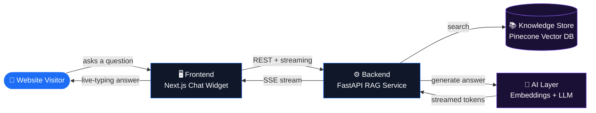
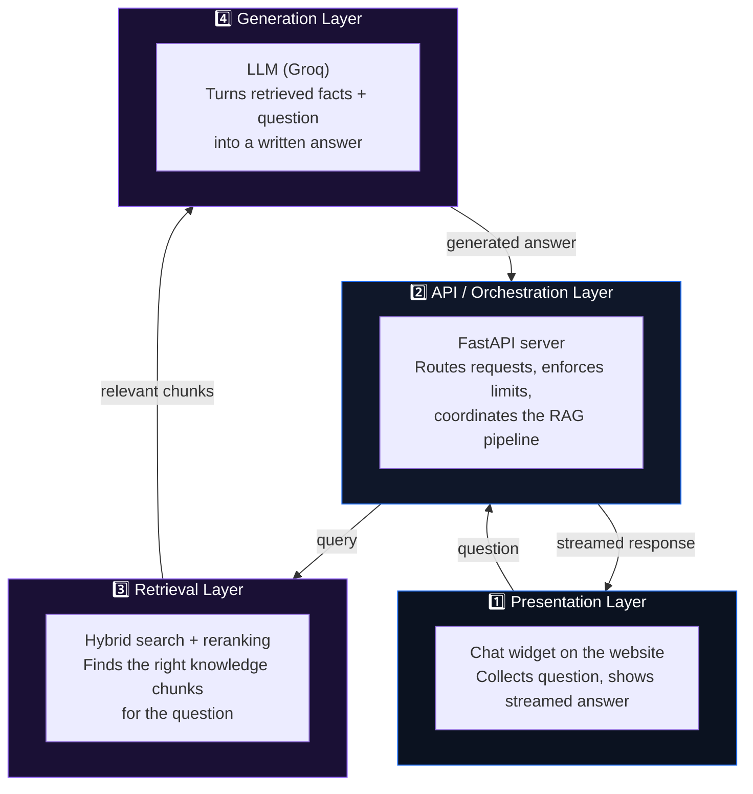
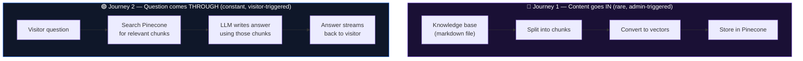
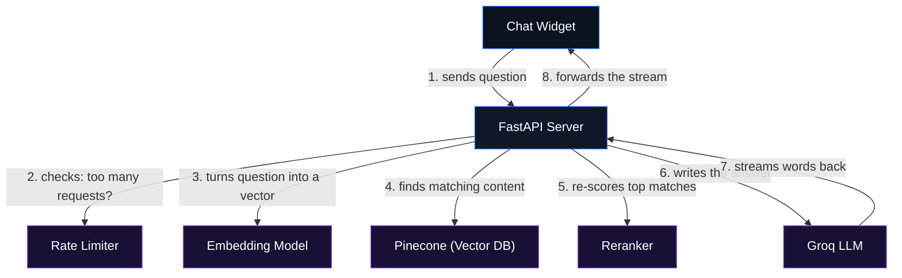

# Stackular Chatbot — High-Level Architecture

A 30,000-foot view of the system. Use this for the "walk me through your project" opener before diving into the detailed diagram ([ARCHITECTURE_DIAGRAM.md](ARCHITECTURE_DIAGRAM.md)).

---

## 1. The Big Picture

Four systems, three connections between them:

That's the whole product. Everything else is detail on top of these four boxes.

---

## 2. Four Layers, Four Jobs

Each layer has exactly one job. This separation is the thing to emphasize in an interview — it's why the system is testable, swappable, and debuggable (e.g., swap Groq for OpenAI without touching retrieval; swap Pinecone for another vector DB without touching the LLM call).

---

## 3. Two Journeys Through the System

Every RAG system has exactly two paths data takes. Naming both, unprompted, is the single strongest signal of understanding the pattern (not just having copied a tutorial).

- **Journey 1** happens maybe once a week, when someone edits company content.
- **Journey 2** happens on every single chat message.

They share the vector database as the handoff point — Journey 1 fills it, Journey 2 reads from it. This is the core insight of RAG: **the LLM never "learns" the company's content**; it's handed the relevant slice fresh on every request.

---

## 4. Core Concepts to Know Cold

| Concept | One-line definition | Where it lives here |
|---|---|---|
| **RAG** | Look up relevant info first, then have the LLM write an answer using it | The whole architecture |
| **Embedding** | Turning text into a list of numbers that captures its meaning | Frontend question → vector, before search |
| **Vector database** | A database built to find "similar" vectors fast, at scale | Pinecone |
| **Hybrid search** | Combining meaning-based search with keyword-based search | Retrieval layer |
| **Reranking** | A second, smarter pass that re-orders search results by true relevance | Retrieval layer, after hybrid search |
| **Prompt engineering** | Writing careful instructions so the LLM answers in the right tone/format/scope | Generation layer |
| **Streaming response** | Sending the answer word-by-word instead of waiting for the whole thing | Backend → Frontend (SSE) |
| **Rate limiting** | Capping how many requests one visitor can send, to prevent abuse | API layer |

If your friend can define each of these in one sentence and point at the box on the diagram where it lives, that covers 90% of what a RAG-focused interview question will probe.

---

## 5. What Connects to What (in plain English)

Numbered so it can be narrated top to bottom exactly as drawn.

---

## 6. Why It's Built This Way (design reasoning, not just "what")

- **Why not just fine-tune an LLM on company content?** Fine-tuning is expensive, slow to update, and can't cite sources. RAG updates instantly (edit the markdown, reindex) and every answer is traceable back to a real document.
- **Why hybrid search instead of just embeddings?** Pure semantic search misses exact terms — company names, acronyms, job titles. Keyword search misses paraphrasing. Combining both covers more real questions.
- **Why rerank after search?** Initial search is optimized for speed over large data (cast a wide net). Reranking is slower but smarter, so it's only run on the small shortlist — best of both.
- **Why stream the answer instead of waiting for the full response?** Perceived speed. An LLM answer can take 3-5 seconds to fully generate; streaming shows the first words almost immediately.
- **Why separate ingestion from querying?** Ingestion is a heavy, occasional batch job (re-embedding a whole knowledge base). Querying must be fast and cheap on every request. Coupling them would make every chat message slow.

---

## 7. How to Present This in an Interview

1. Start with **Section 1** — the four-box picture. Get the interviewer oriented in 15 seconds.
2. Name the **two journeys** (Section 3) before anything else — it immediately signals "I understand RAG, not just glue code."
3. Walk the **numbered connections** (Section 5) as the request lifecycle.
4. If asked "why this design" for any piece, answer from **Section 6** — reasoning beats description.
5. Only go into implementation specifics (chunk sizes, alpha weights, exact model names) if asked — that's what [ARCHITECTURE_DIAGRAM.md](ARCHITECTURE_DIAGRAM.md) covers.
