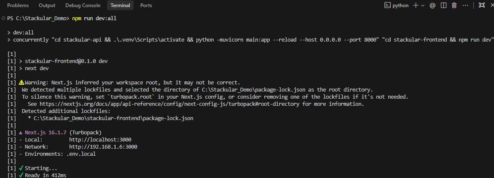
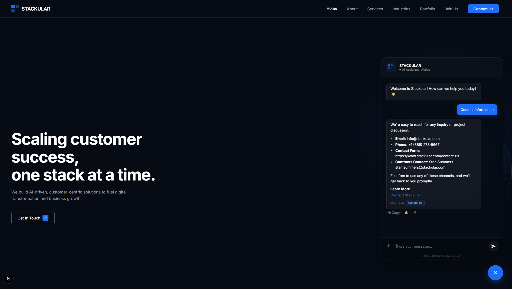

# Stackular Website Chatbot

This project is an AI-powered website chatbot designed for the Stackular website. It provides automated, context-aware responses to visitor queries relating to Stackular's services, industry expertise, and company contact information.

## What We Did

We built an intelligent Retrieval-Augmented Generation (RAG) chatbot capable of answering questions about Stackular. Content is maintained as a curated Markdown knowledge base rather than scraped at runtime, so answers stay grounded in reviewed, accurate information. The bot combines dense vector search with BM25 keyword matching (hybrid search), reranks the results for relevance, and streams grounded answers back to the visitor in real time.

## How We Did It — Architectural Flow

```
User query
    │
    ▼
Next.js frontend (ChatWidget.jsx)
    │  POST /chat { question, session_id }
    ▼
FastAPI backend (port 8000)
    │
    ├─ Follow-ups rewritten into standalone queries (condense_question)
    │
    ├─ Hybrid retrieval from Pinecone
    │    ├─ Dense: BAAI/bge-small-en (384-dim, local)
    │    └─ Sparse: BM25Encoder (pinecone-text)
    │
    ├─ Reranked to the most relevant chunks (Pinecone-hosted bge-reranker-v2-m3)
    │
    ├─ Context + chat history injected into prompt
    │
    └─ Groq API → openai/gpt-oss-120b → StreamingResponse (SSE)
```

### Knowledge Base & Indexing Flow

```
knowledge_base.md (local Markdown, source of truth)
    │
    ├─ RecursiveCharacterTextSplitter (600 chars / 100 overlap)
    │
    ├─ Dense embeddings: BAAI/bge-small-en (384-dim, sentence-transformers)
    ├─ Sparse embeddings: BM25Encoder (pinecone-text)
    │
    └─ Hybrid upsert → Pinecone index "bge-small-en" (dotproduct metric)
         └─ bm25_params.json saved to repo root (auto-generated on reindex)
```

To update the knowledge base:
1. Edit `knowledge_base.md`
2. Trigger a reindex: `POST /admin/reindex` with header `X-Admin-Token: <your-token>`
3. Confirm it landed: `GET /health` should report `vectors_in_index` greater than zero

## Models and Technologies Used

### Core Models

| Component | Value |
|---|---|
| LLM | `openai/gpt-oss-120b` via Groq API, temperature 0.3 |
| Query condensing | `openai/gpt-oss-20b` via Groq API — rewrites follow-ups before retrieval |
| Embedding | `BAAI/bge-small-en` (384-dim, local via sentence-transformers) |
| Sparse | BM25Encoder via `pinecone-text` |
| Reranker | `bge-reranker-v2-m3`, Pinecone-hosted |

### Infrastructure Stack

- **Vector Database:** Pinecone serverless (AWS us-east-1, `dotproduct` metric — required for hybrid search)
- **Backend API:** FastAPI + Uvicorn (port 8000), rate-limited via slowapi
- **Frontend:** Next.js 14 App Router (port 3000)
- **Orchestration:** LangChain (text splitting, message formatting)
- **Dev runner:** `concurrently` via root `npm run dev:all`

## Frontend Features

- Floating chat bubble (bottom-right, fixed position)
- Full markdown rendering: bullet lists, numbered lists, bold, inline code, links (XSS-safe)
- Voice input via Web Speech API
- Copy, 👍/👎 feedback, and retry-on-error on every bot message
- "Talk to the team" CTA after 3+ bot exchanges
- Chat resets on every page refresh (no localStorage persistence)
- Mobile-responsive panel (`min(360px, calc(100vw - 32px))`)

## API Endpoints

| Method | Path | Auth | Description |
|---|---|---|---|
| GET | `/` | None | Health ping |
| GET | `/health` | None | Returns `{status, vectors_in_index}` |
| POST | `/chat` | None (rate-limited) | Streaming chat (text/event-stream) |
| POST | `/event` | None (rate-limited) | Lightweight product analytics event |
| POST | `/feedback` | None (rate-limited) | 👍/👎 rating on a chat message |
| POST | `/admin/reindex` | `X-Admin-Token` header | Triggers background reindex from knowledge_base.md |

## Try the Chatbot

*(Placeholder: link to the deployed application will go here once hosted publicly.)*

Until then, follow the steps below to run it locally — the walkthrough ends with a look at it actually running.

## How to Run the Project Locally

### 1. Prerequisites

Ensure you have the following installed on your system:
- Python 3.10+ (3.11 or 3.12 recommended for production — see the Pydantic warning note below)
- Node.js & npm (v18+)

### 2. Environment Configuration

Create `stackular-api/.env` with the following:

```text
GROQ_API_KEY=your_groq_api_key_here
PINECONE_API_KEY=your_pinecone_api_key_here
ADMIN_TOKEN=your_admin_token_here
ALLOWED_ORIGINS=*
```

> **Before production deploy:** Set `ALLOWED_ORIGINS=https://www.stackular.com` and use a strong random `ADMIN_TOKEN`.

### 3. Install Root Dependencies

From the root of the project directory (`Stackular_Demo`), install the dependencies that allow running the app in one command:

```bash
npm install
```

### 4. Install Component Dependencies

Make sure both halves of the project are set up:

**Backend:**
```bash
cd stackular-api
python -m venv .venv
.\.venv\Scripts\activate
pip install -r requirements.txt
cd ..
```

**Frontend:**
```bash
cd stackular-frontend
npm install
cd ..
```

### 5. Start the Application

Return to the root directory (`Stackular_Demo`) and run the following command to boot both systems concurrently. On first run, the backend downloads the embedding model and auto-creates the Pinecone index if it doesn't exist, then populates it from `knowledge_base.md` on the first request if it's empty.

```bash
npm run dev:all
```



**The Pydantic warning explained**<br>
<sub>*UserWarning: Core Pydantic V1 functionality isn't compatible with Python 3.14 or greater.*</sub><br>
<sub>*LangChain relies on Pydantic V1 internally, and Python 3.14 is new enough to trip a compatibility warning against it. It's non-blocking — the app runs normally — but for a production environment, use Python 3.11 or 3.12, the current stable standards for AI/ML libraries.*</sub>

### 6. Access the Application

Open your browser and navigate to:
`http://localhost:3000`


